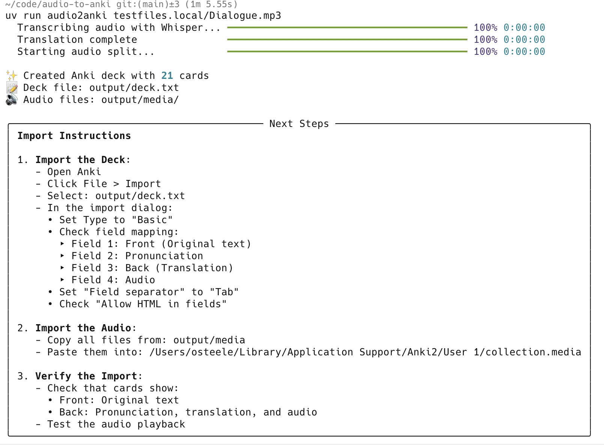

# audio2anki

Convert audio and video files into Anki flashcard decks with translations.

`audio2anki` helps language learners create study materials from audio and video content. It automatically:
- Transcribes audio using OpenAI Whisper
- Segments the audio into individual utterances
- Translates each segment using OpenAI or DeepL
- Generates pronunciation (currently supports pinyin for Mandarin)
- Creates Anki-compatible flashcards with audio snippets



## Features

- 🎵 Process audio files (mp3, wav, etc.) and video files
- 🤖 Automatic transcription using OpenAI Whisper
- 🔤 Automatic translation and pronunciation
- ✂️ Smart audio segmentation
- 📝 Optional manual transcript input
- 🎴 Anki-ready output with embedded audio

## System Requirements

- Python 3.10 or higher
- ffmpeg (for audio processing)

On macOS, install ffmpeg using Homebrew:
```bash
brew install ffmpeg
```

On Ubuntu/Debian:
```bash
sudo apt-get install ffmpeg
```

On Windows:
1. Install [Chocolatey](https://chocolatey.org/)
2. Run: `choco install ffmpeg`

## Requirements

- Python 3.10 or later
- OpenAI API key (set as `OPENAI_API_KEY` environment variable) or DeepL API token (set as `DEEPL_API_TOKEN` environment variable)

## Installation

```bash
uv tool install https://github.com/osteele/audio2anki.git
```

## Usage

### Basic Usage

Create an Anki deck from an audio file:
```bash
export OPENAI_API_KEY=your-api-key-here
audio2anki audio.mp3
```

Use an existing transcript:
```bash
export OPENAI_API_KEY=your-api-key-here
audio2anki audio.mp3 --transcript transcript.txt
```

### Audio Cleaning

The tool can clean audio files to improve transcription quality:

```bash
audio2anki audio.mp3 --clean  # Force cleaning
```

Audio cleaning behavior:
- With `--clean`: Always clean audio. Fails if `HF_TOKEN` is missing and no cached clean file exists
- With `--no-clean`: Skip cleaning, even if cached clean files exist
- Default (no flag): Clean if `HF_TOKEN` is present OR a cached clean file exists

Cleaned files are cached in the same directory as the input file, with names like `original-name.cleaned-HASH.mp3`.

**Large File Handling:**
- Files larger than 25MB are automatically split into 5-minute segments
- Each segment is cleaned separately and then recombined
- If any segment fails to clean:
  - With `--clean`: The entire process fails
  - Without `--clean`: Falls back to using the original file
- Cleaned files are cached to avoid reprocessing

### Common Use Cases

Process a noisy recording with more aggressive silence removal:
```bash
audio2anki audio.mp3 --silence-thresh -30
```

Process a quiet recording or preserve more background sounds:
```bash
audio2anki audio.mp3 --silence-thresh -50
```

Process a podcast with custom segment lengths and silence detection:
```bash
audio2anki podcast.mp3 --min-length 2.0 --max-length 20.0 --silence-thresh -35
```

### Command Line Options

```bash
audio2anki <input-file> [options]

Options:
  --transcript FILE    Use existing transcript
  --output DIR        Output directory (default: ./output)
  --model MODEL       Whisper model (tiny, base, small, medium, large)
  --debug            Generate debug information
  --min-length SEC   Minimum segment length (default: 1.0)
  --max-length SEC   Maximum segment length (default: 15.0)
  --language LANG    Source language (default: auto-detect)
  --silence-thresh DB Silence threshold (default: -40)
  --clean            Force audio cleaning
  --no-clean         Skip audio cleaning
```

### Environment Variables

Required:
- `OPENAI_API_KEY` - OpenAI API key (required if DeepL is not used)

Optional:
- `DEEPL_API_TOKEN` - DeepL API key (recommended for higher quality translations)

### Translation Services

The tool supports two translation services:

1. **DeepL** (Preferred)
   - Higher quality translations, especially for European languages
   - Get an API key from [DeepL Pro](https://www.deepl.com/pro-api)
   - Set environment variable: `export DEEPL_API_TOKEN=your-api-key`

2. **OpenAI** (Fallback)
   - Used when DeepL is not configured or fails
   - Get an API key from [OpenAI](https://platform.openai.com/api-keys)
   - Set environment variable: `export OPENAI_API_KEY=your-api-key`

The tool will automatically:
1. Try to use DeepL first if `DEEPL_API_TOKEN` is set
2. Fall back to OpenAI if DeepL is not available or fails
3. Show an error if neither API key is available

### Output

The script creates:
1. A tab-separated deck file (`deck.txt`) containing:
   - Original text (e.g., Chinese characters)
   - Pronunciation (e.g., Pinyin with tone marks)
   - English translation
   - Audio reference
2. A `media` directory containing the audio segments

### Importing into Anki

1. **Import the Deck**:
   - Open Anki
   - Click `File` > `Import`
   - Select the generated `deck.txt` file
   - In the import dialog:
     - Set the Type to "Basic"
     - Check that fields are mapped correctly:
       - Field 1: Front (Original text)
       - Field 2: Pronunciation
       - Field 3: Back (Translation)
       - Field 4: Audio
     - Set "Field separator" to "Tab"
     - Check "Allow HTML in fields"

2. **Import the Audio**:
   - Copy all files from the `media` directory
   - Paste them into your Anki media collection:
     - On Mac: [~/Library/Application Support/Anki2/User 1/collection.media](file:///Users/$(whoami)/Library/Application%20Support/Anki2/User%201/collection.media)
     - On Windows: [%APPDATA%\Anki2\User 1\collection.media](file:///C:/Users/%USERNAME%/AppData/Roaming/Anki2/User%201/collection.media)
     - On Linux: [~/.local/share/Anki2/User 1/collection.media](file:///home/$(whoami)/.local/share/Anki2/User%201/collection.media)

3. **Verify the Import**:
   - The cards should show:
     - Front: Original text
     - Back: Pronunciation, translation, and a play button for audio
   - Test the audio playback on a few cards

**Note**: The audio filenames include a hash of the source file to prevent conflicts when importing multiple decks.

## Development

```bash
just check  # Run linting and type checking
just test   # Run tests
```

## License

MIT License 2024 Oliver Steele
