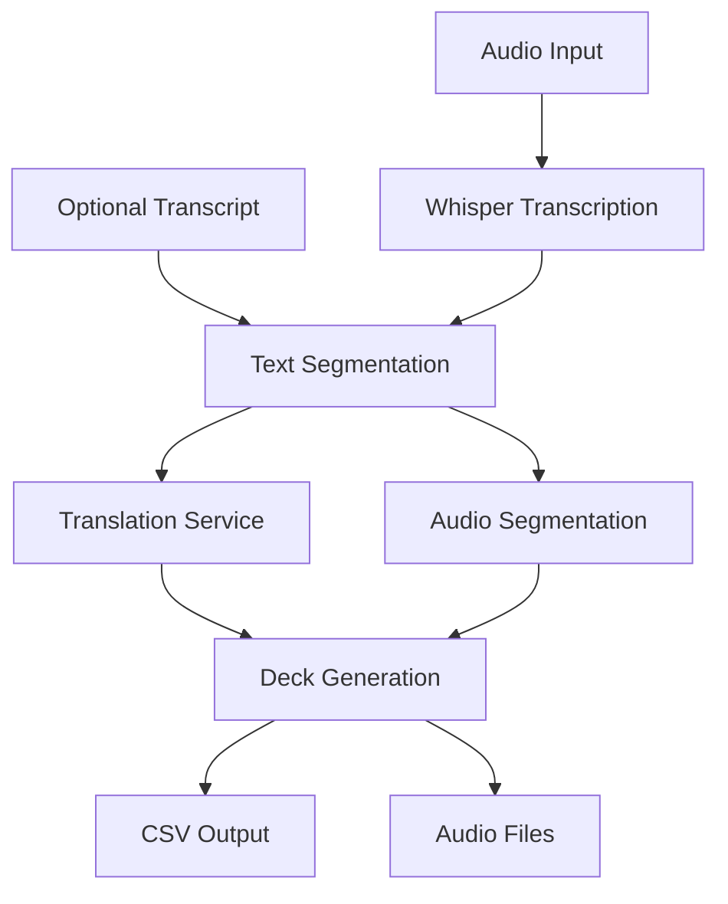

# audio2anki Specification

## Overview

`audio2anki` is a command-line tool that converts audio content into Anki flashcards. It processes audio files to create study materials with synchronized text, translations, and audio segments.

## System Architecture

## Components

### 1. Input Processing
- Accept audio files (mp3, wav, m4a) or video files
- Optional transcript input in plain text or SRT format
- Validate input files and formats

### 2. Transcription (via OpenAI Whisper)
- Transcribe audio to text with timestamps
- Auto-detect or specify source language
- Handle long audio files in chunks

### 3. Segmentation
- Split transcription into meaningful utterances
- Maintain timestamp mapping
- Smart sentence boundary detection

### 4. Translation (via OpenAI)
- Translate source text to English
- Generate pronunciation (e.g., pinyin for Mandarin)
- Preserve segment alignment

### 5. Audio Processing
- Extract audio from video if needed
- Split audio file into segments
- Export in Anki-compatible format

### 6. Output Generation
- Create CSV with fields:
  - Source text
  - Pronunciation
  - English translation
  - Audio filename
- Generate media files in Anki format
- Package for easy import

## File Formats

### Input
- Audio: mp3, wav, m4a, mp4 (audio extracted)
- Transcript (optional): txt, srt

### Output
- CSV file for Anki import
- Directory of audio snippets (mp3)
- Debug log file (optional)

## Dependencies

- OpenAI Whisper for transcription
- OpenAI GPT-4 for translation
- pydub for audio processing
- rich for CLI interface

## Error Handling

- Validate input files before processing
- Graceful handling of API failures
- Clear error messages for common issues
- Debug mode for troubleshooting

## Future Enhancements

1. Support for batch processing
2. Web interface
3. Custom vocabulary lists
4. Alternative translation services
5. Support for other languages
6. Progress saving for long files
7. Custom Anki note types
